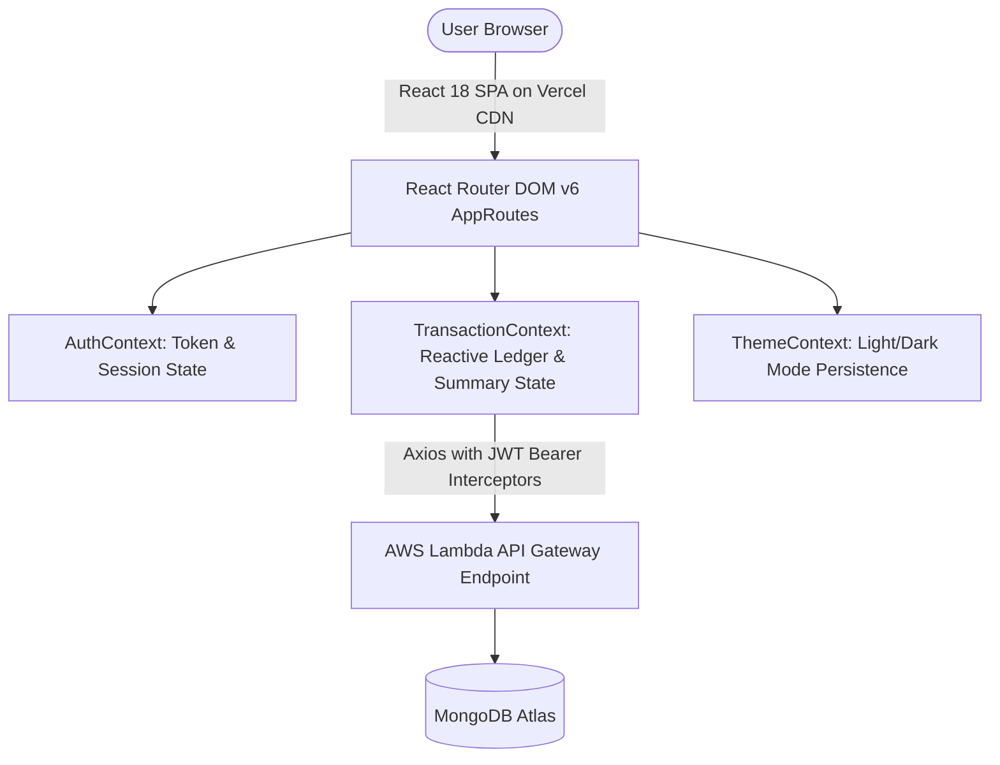

# Money Manager – Frontend Client 📊

A modern, responsive Single Page Application (SPA) for personal and business finance tracking, real-time analytics, and multi-account transfers. Built with React 18, Vite, and Tailwind CSS, and deployed to Vercel Edge CDN.

---

## 🔗 Links

- **Live Application (Vercel)**: [https://moneymanager-harshit.vercel.app](https://moneymanager-harshit.vercel.app)
- **Backend Repository**: [https://github.com/Harshit-Patle/money-manager-backend](https://github.com/Harshit-Patle/money-manager-backend)

---

## 📌 Overview & Problem Statement

Managing finances across personal expenses and office budgets often becomes chaotic when using static spreadsheets or generic apps that lack categorical breakdowns and account transfer visibility.

**Money Manager Client** delivers an interactive, accessible dashboard allowing users to:
1. View dynamic financial summaries and cash flow trends.
2. Filter transactions simultaneously by date range, category, and division.
3. Manage multi-account fund movements (**Cash**, **Bank**, **Wallet**).
4. Experience instant, reactive UI updates without full page reloads.

---

## 🏗️ High-Level Architecture



---

## ✨ Key Features

### 1. Interactive Dashboard & Visualizations
- **Summary Cards**: Real-time totals for Total Income, Total Expenses, and Net Balance.
- **Trend Charts**: Interactive bar and area charts (powered by Recharts) comparing monthly, weekly, and custom date ranges.
- **Dynamic Category Summary**: Synchronized pie charts and percentage distributions that reactively adapt to active filter criteria.

### 2. Transaction Management
- **Modal Entry Forms**: Two-tab modal interface for recording income and expense records with category tagging, account selection, and division.
- **12-Hour Editable Indicator**: Visual badges indicating whether a transaction is within its 12-hour edit window or locked.
- **Inline Actions**: Quick edit and delete triggers with confirmation dialogs.

### 3. Multi-Account Transfers
- **Dedicated Transfer Portal**: Inter-account fund transfers (e.g., Bank $\to$ Wallet) with validation preventing same-account selections.
- **Transfer Ledger**: Tabular transfer history tracking date, division, and timestamps.

### 4. UX & Responsive Design
- **Route Code Splitting**: Asynchronously loads page components (`React.lazy` + `Suspense`) to minimize initial bundle size (~234 kB).
- **Theme Persistence**: Light and Dark mode toggle with system preference detection and `localStorage` persistence.
- **Client Route Guards**: Protected and Public route wrappers (`ProtectedRoute`, `PublicRoute`) guarding authenticated views.

---

## 🛠️ Actual Tech Stack

| Layer | Technology | Purpose |
|---|---|---|
| **Framework & Build** | React 18 & Vite 5 | Core UI framework and ultra-fast module bundler |
| **Styling** | Tailwind CSS 3.3 | Utility-first responsive design system |
| **Routing** | React Router DOM v6 | SPA navigation with v7 future flag compatibility |
| **HTTP Client** | Axios | Centralized client with JWT request/response interceptors |
| **Data Visualization** | Recharts | Responsive SVG charts and category pie breakdowns |
| **UI Components** | Headless UI & Heroicons | Accessible dialog modals, dropdowns, and SVG icons |
| **Date Manipulation** | date-fns | Date calculations, formatting, and boundary ranges |
| **Hosting & CDN** | Vercel | Global edge hosting with `vercel.json` SPA rewrites |

---

## 🧠 Important Technical Decisions

1. **Reactive Auth-State Synchronization**:
   - `TransactionContext` directly consumes `useAuth()`. When authentication changes, transaction data and category summaries are fetched automatically, and all state arrays are reset upon logout—eliminating `window.location.reload()` hacks.

2. **Route-Level Code Splitting**:
   - Implemented `React.lazy()` and `<Suspense>` across `Login`, `Register`, `Home`, `Dashboard`, and `TransferPage`, reducing initial bundle size by over 65%.

3. **SPA Routing via `vercel.json`**:
   - Configured rewrite rules in [`vercel.json`](file:///vercel.json) to redirect all subroutes to `/index.html`, eliminating 404 errors on browser refresh.

---

## 🔐 Environment Variables

Configured via `.env` (template provided in [`.env.example`](file:///.env.example)):

| Variable | Description | Example / Format |
|---|---|---|
| `VITE_API_URL` | Base URL of the backend API | `http://localhost:5000/api` (local) or `https://<api-id>.execute-api.<region>.amazonaws.com/api` (prod) |

---

## 📦 Local Run Instructions

### Prerequisites
- Node.js (v18 or v20+)
- npm or yarn package manager

### Steps
1. **Clone the repository**:
   ```bash
   git clone https://github.com/Harshit-Patle/money-manager-frontend.git
   cd money-manager-frontend
   ```

2. **Install dependencies**:
   ```bash
   npm install
   ```

3. **Configure environment**:
   ```bash
   cp .env.example .env
   # Ensure VITE_API_URL points to your local backend (http://localhost:5000/api)
   ```

4. **Start Vite development server**:
   ```bash
   npm run dev
   ```
   Open `http://localhost:5173` in your browser.

5. **Build for production**:
   ```bash
   npm run build
   ```

---

## 👤 Pre-Seeded Demo Account

| Email | Password | Access |
|---|---|---|
| `demo.user@moneymanager.com` | `Password@123` | Pre-populated with income, expense, and transfer records |

---

## ⚠️ Known Limitations

- **Browser Storage Dependency**: Authentication tokens and theme preferences rely on browser `localStorage`.
- **Backend Cold Start Timing**: When connected to serverless backend endpoints, initial requests after inactivity may take a few seconds during container warm-up.
